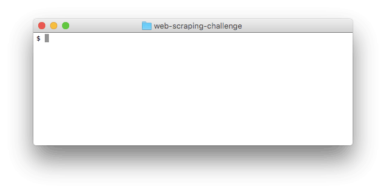

# Using Data from HTML

## Summary
We live in a world where a vast amount of information is available in [structured documents][] (e.g., HTML and XML).  In order to make use of this information in a software application, the data must be extracted from the document and translated into something the application can use.

Extracting information from a website is known as [web scraping][].  In this exercise, we'll build a web scraper to scrape a website menu.  We'll use the scraper as part of an application that recommends meals to a user based on what the user wants to eat.


## Progression
### Part 0:  Install the Nokogiri Gem
We'll rely on the [Nokogiri][] gem to convert the HTML into Ruby objects.  Nokogiri is likely an unfamiliar tool, and one of the technical challenges we'll face is learning how to use it.


Before we begin the exercise the Nokogiri gem must be installed.  It should be installed on the Dev Bootcamp workstations.  If we're working on a personal machine, we can check to see which, if any, versions of Nokogiri are installed (see Figure 1).  If any versions of Nokogiri are installed, they will be listed under the local gems heading.

```
$ gem list nokogiri

*** LOCAL GEMS ***

nokogiri (1.6.8, 1.6.7.2, 1.6.7.1, 1.6.6.2)
```
*Figure 1*.  Checking to see which, if any, versions of Nokogiri are installed.


If no versions of Nokogiri are installed, we'll need to install one.  Follow the [installation instructions][Nokogiri installation] for the appropriate operating system from the Nokogiri documentation.  Unfortunately, installing Nokogiri does not always go smoothly.  If we run into issues, follow the troubleshooting guides in the docs.  If that doesn't help, seek an instructor.


### Part 1:  Explore Nokogiri
To build our application, we'll need to pull data from HTML and into our Ruby application.  If we were working on a project, we might explore different approaches and technologies for accomplishing that.  In this exercise the decision has been made for us; we'll be using Nokogiri.

But, we still need to learn how to use Nokogiri.  Follow along through the [Nokogiri tutorials][] on parsing and searching an HTML document and/or The Bastard's Book of Ruby guide to [parsing HTML with Nokogiri][BBR Guide].

Open IRB and ensure that we can use Nokogiri to extract data from HTML.  A short HTML file has been provided for us:  `html-samples/example.html`.  Can we extract the text within the `<h1>` tag?  What about the text within the second element with the class `text`?

*Note:*  We'll use [CSS selectors][] alongside Nokogiri; review them as necessary.


### Part 2:  Recommend Meals Containing a Specific Food
Build an application that saves diners at the restaurant the trouble of reading through the menu.  Users will run our application and pass in a food they want to eat.  Our application will scrape the restaurant's website and present the user with meals containing that food.

In building the application, we'll want to make appropriate object-oriented design decisions.  What classes do we need to model the data from the website's menu?  What state should each class have?  What behaviors does each class need?  

We can see an example implementation in Figure 2.

  
*Figure 2*.  Recommending meals that contain specific foods.

*Note:* For this exercises, rather than attempting to parse a live website, use the file `html-samples/cafeteria.html`.  This will prevent the class from hammering a website server with requests.  For the next exercise, we'll switch to parsing a live website.

## Conclusion
Be empowered:  the entire internet is now our data input.  When data is encoded in HTML, we can now extract that data and use it in our own applications.


[BBR Guide]: http://ruby.bastardsbook.com/chapters/html-parsing/
[CSS selectors]: https://developer.mozilla.org/en-US/docs/Web/Guide/CSS/Getting_started/Selectors
[Nokogiri]: http://www.nokogiri.org/
[Nokogiri installation]: http://www.nokogiri.org/tutorials/installing_nokogiri.html
[nokogiri tutorials]: http://www.nokogiri.org/tutorials/
[structured documents]: https://en.wikipedia.org/wiki/Structured_document
[web scraping]: https://en.wikipedia.org/wiki/Web_scraping
